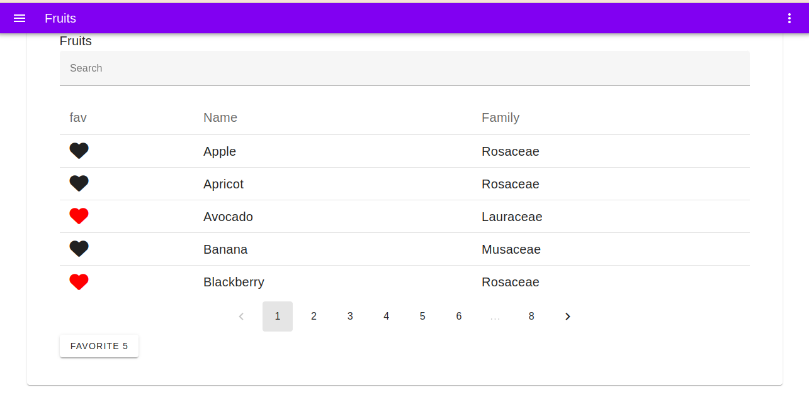

 

## Steps of Installation

- git clone https://github.com/AmsaluGit/fruit-vice.git
- cd Fruityvice
- update .env according to your database credentials
- composer install
- npm install
- create database 'fruit' in your local machine.
- bin/console doctrine:migrations:migrate
- php bin/console fruits:fetch
- symfony server:start -d
- go to http://127.0.0.1:8000 as shown in your terminal.
